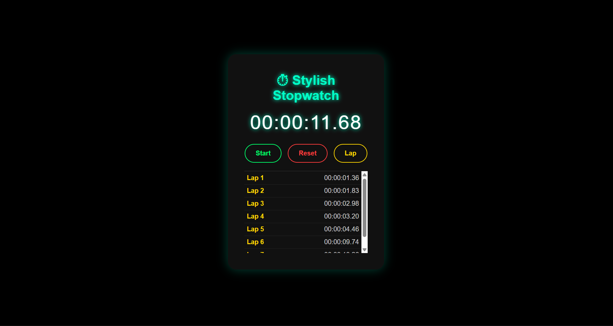

# PRODIGY_WD_02 - Stopwatch Web App  

This project is a **responsive Stopwatch Application** built using **HTML, CSS, and JavaScript**.  
It follows a **dark neon theme design** with smooth animations and provides features like start, pause, reset, and lap recording.  

---

## 🚀 Tech Stack  
- **HTML5** – Structure of the app  
- **CSS3** – Styling and responsive design (dark neon theme)  
- **JavaScript** – Stopwatch functionality (timers & laps)  

---

## 📸 Preview  

**Stopwatch Screenshot 1**  
  

---

## ✨ Author  
**Ayush Badola**  
📧 [ayushbadola74@gmail.com](mailto:ayushbadola74@gmail.com)  
🌐 [GitHub Profile](https://github.com/ayushbadola74)  

---

🌍 Live Demo  
[Click here to view the Stopwatch](https://ayushbadola74.github.io/PRODIGY_WD_02/)  